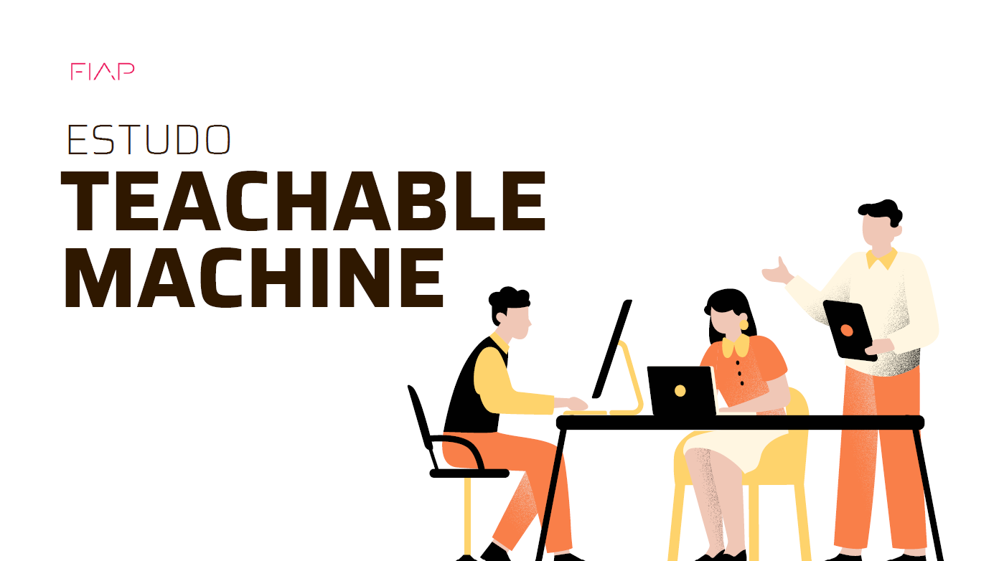

<h1 align="center"> Primeiro estudo utilizando visao computacional - Techable Machine</h1>

Índice;
## 📌 Descrição do Projeto:
A cozinha é um ambiente repleto de utensílios que facilitam o preparo das refeições. No entanto, encontrar o utensílio certo pode ser um desafio, principalmente para quem tem pouco espaço de armazenamento ou para pessoas com deficiência visual. A Inteligência Artificial (IA) pode ser uma aliada nessa tarefa, permitindo a detecção automática de utensílios de cozinha através de imagens.

Neste estudo de caso, utilizaremos o Teachable Machine do Google para desenvolver um modelo de IA capaz de identificar e classificar diferentes utensílios de cozinha a partir de fotografias. O modelo será construído de forma interativa e acessível, utilizando uma interface amigável que não exige conhecimentos técnicos aprofundados.

Status do Projeto: 

Funcionalidades e Demonstração da Aplicação;
# :hammer:📌Etapas do estudo
- `Etapa 1`: Coleta de dados:

    - `Etapa 1a`: Reunir um conjunto de imagens de diferentes utensílios de cozinha, categorizando-as por tipo (por exemplo talheres, panelas, utensílios de preparo).
    - `Etapa 1b`: Assegurar a qualidade das imagens, com boa iluminação, foco nítido e ausência de objetos extras que possam interferir na detecção.
    - `Etapa 1c`: Dividir as imagens em dois conjuntos: um para treinamento do modelo e outro para teste.

- `Etapa 2`: Treinamento do modelo:

    - `Etapa 2a`: Acessar o Teachable Machine <https://teachablemachine.withgoogle.com> e selecionar a opção "Classificação de Imagem" e depois “Imagem Padrão”.
    - `Etapa 2b`: Carregar o conjunto de imagens de treinamento, organizando-as por categoria (exemplo talheres, panelas, utensílios de preparo).
    - `Etapa 2c`: Ajustar os parâmetros do modelo, como o número de classes e o tamanho da imagem.
    - `Etapa 2d`: Treinar o modelo, monitorando seu desempenho através das métricas de precisão e acurácia. Faça testes mexendo nas configurações avançadas épocas, batch size e learning rate.

- `Etapa 3`: Teste e avaliação do modelo:

    - `Etapa 3a`: Carregar o conjunto de imagens de teste no Teachable Machine.
    - `Etapa 3b`: Observar como o modelo se comporta ao classificar as novas imagens, identificando erros e acertos.
    - `Etapa 3c`: Observar as métricas de precisão e acurácia do modelo para o conjunto de teste.
    - `Etapa 3d`: Analisar os resultados e identificar oportunidades para aprimorar o modelo.

- `Etapa 4`: Elaborar um relatório em PDF detalhando o processo de desenvolvimento do modelo, incluindo:

     - `Etapa 4a`: Descrição dos objetivos e da metodologia utilizada.
     - `Etapa 4b`: Prints das principais etapas do projeto, incluindo da taxa de acurácia final.
     - `Etapa 4c`: Explicação de como cada etapa foi realizada.
     - `Etapa 4d`: Justificativa técnica dos resultados obtidos.
     - `Etapa 4e`: Análise crítica do desempenho do modelo e sugestões de melhorias.

## 📌Demonstração da Aplicação
[Esudo Techable Machine](Estudo-Teachable-Machine/TechableMachine.pdf)

## 📌Acesso ao Projeto
Tecnologias utilizadas;
Pessoas Contribuidoras;
Pessoas Desenvolvedoras do Projeto;
Licença.
